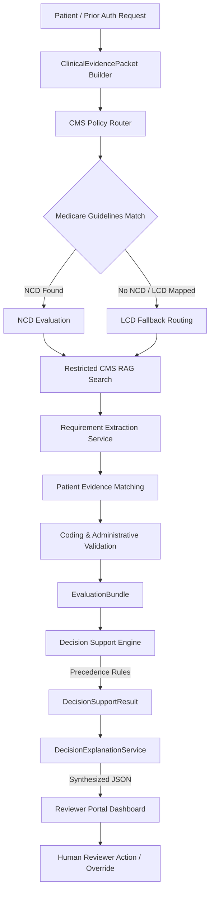

# U.S. CMS/Medicare Prior Authorization Decision-Support System

## 1. Project Overview
This project is a decision-support prototype designed to evaluate patient prior-authorization requests against U.S. Medicare National Coverage Determinations (NCDs), Local Coverage Determinations (LCDs), and Billing & Coding Articles. 

It implements a hybrid clinical engine where **LLMs extract and match patient evidence**, while **deterministic validations evaluate code compliance, state MAC jurisdictions, and effective dates**.

---

## 2. Architecture Diagram



---

## 3. Technology Stack
* **Frontend**: React, TypeScript, Vite, Vanilla CSS.
* **Backend**: FastAPI, Python, Pydantic, Pytest.
* **Database**: MongoDB Atlas (with Vector Search index).
* **LLM Provider**: OpenRouter API provider abstraction (mocking failover supported).

---

## 4. Setup & Installation

### Prerequisite Environment Variables (`backend/.env`)
Create a file at `backend/.env` with the following variables:
```bash
MONGODB_URI="mongodb+srv://..."
OPENROUTER_API_KEY="sk-or-v1-..."
EMBEDDING_API_KEY="sk-or-v1-..."
LLM_PROVIDER="mock" # Set to 'openrouter' for live LLM completions
LLM_MODEL="meta-llama/llama-3-8b-instruct:free"
```

### Running Backend Services
1. Navigate to backend:
   ```bash
   cd backend
   ```
2. Install dependencies:
   ```bash
   pip install -r requirements.txt
   ```
3. Run the FastAPI development server:
   ```bash
   uvicorn app.main:app --reload --port 8000
   ```

### Running Frontend Services
1. Navigate to frontend:
   ```bash
   cd ../frontend
   ```
2. Install node dependencies:
   ```bash
   npm install
   ```
3. Run Vite dev server:
   ```bash
   npm run dev
   ```

---

## 5. Demo Case Scenarios
The dashboard highlights five synthetic case evaluation paths:
1. **APPROVE Path**: All mandatory medical necessity and validator checks fully pass.
2. **DENY Path**: Direct contradiction identified (e.g. age limit mismatch) or diagnosis explicitly noncovered.
3. **PEND Path (Real Physical Therapy 97110 Colorado Case)**: Required clinical joint impairment document is unclear/missing in patient history.
4. **NURSE_REVIEW Path**: Geographically active LCD rules conflict or state MAC region code is missing.
5. **DECISION_SUPPORT_UNAVAILABLE Path**: Custom synthetic code requests (e.g. `PROCxxxx`) where no CMS guidelines are available.

---

## 6. Testing Instructions
Run the comprehensive test suite verifying all Volumes 1–8 clinical mappings, routers, and validators:
```bash
cd backend
pytest
```

---

## 7. Disclaimer
> [!IMPORTANT]
> This project is a demonstration decision-support system using synthetic patient data and CMS policy/reference datasets.
>
> It is not a final payer adjudication system and should not be used as a substitute for qualified clinical, coding, legal, or coverage review.
