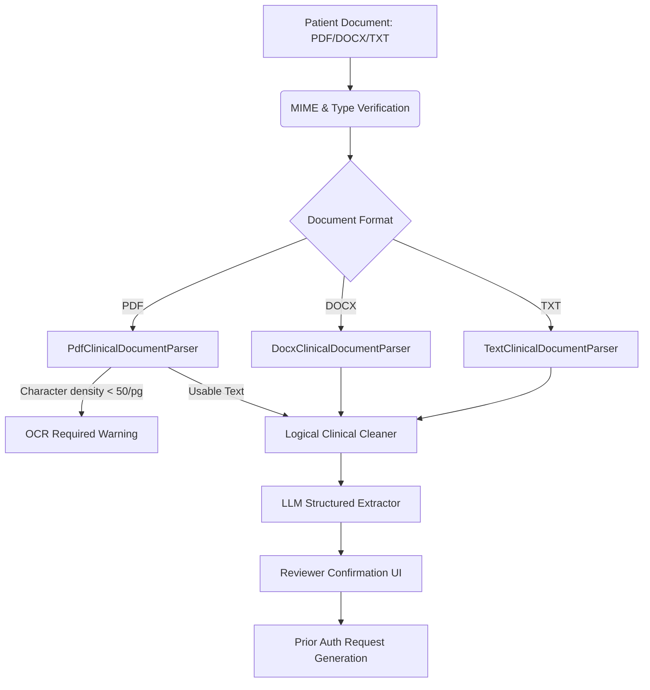

# Clinical Document Intake & Parser Architecture

This report details the architectural specifications for the document-based patient intake, raw document parsing, logical paragraph chunking, and validation pipeline.

## 1. Physical Layout Parsing & Fallback Warnings
The physical parser isolates document layouts programmatically:
* **PDF Parser**: Uses native py-pdf binary streams. If the average character density per page drops below 50 characters, it flags a low-density scanned warning (`OCR_REQUIRED`).
* **DOCX Parser**: Iterates logical table grids and paragraph components to extract nested textual content.
* **TXT Parser**: Reads raw text streams with system-independent UTF-8 mappings.

## 2. Logical Clinical Cleaning
Before feeding extracted text to LLM extraction endpoints, the parser runs a conservative text cleaner:
* Converts multiple consecutive spaces and carriage returns to a single blank space.
* Normalizes non-ASCII characters to standard ASCII equivalence where readable.
* Strips control characters while preserving sentence formatting boundaries.

## 3. Integration with the CMS Pipeline
Upon reviewer confirmation of the extracted clinical facts, the generated prior authorization request is injected back into the existing CMS pipeline. It runs:
1. **CMS Policy Routing**: Geographic and HCPCS mapping.
2. **Restricted RAG Retrieval**: Policy chunk filtering.
3. **Requirement Match Evaluation**: Metadata evidence check.
4. **Decision Support & Triage**: Recommendation verdict.
